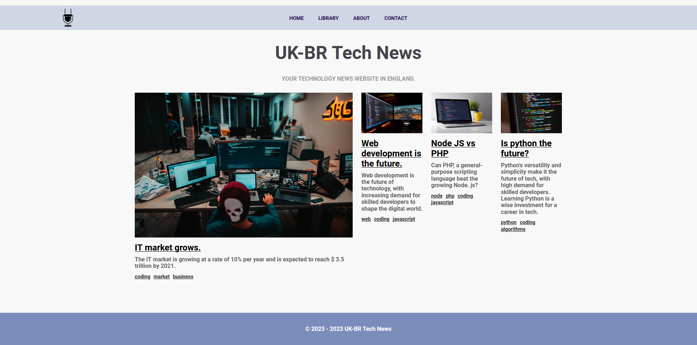
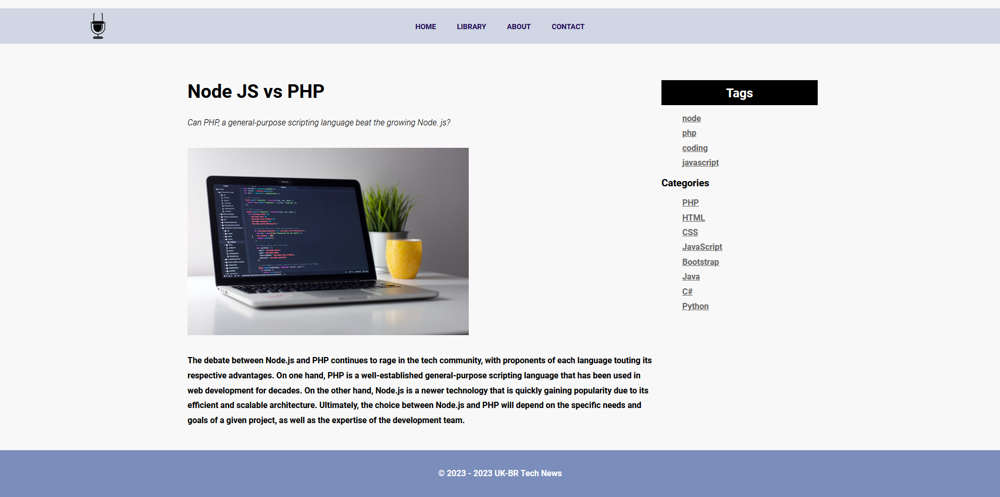
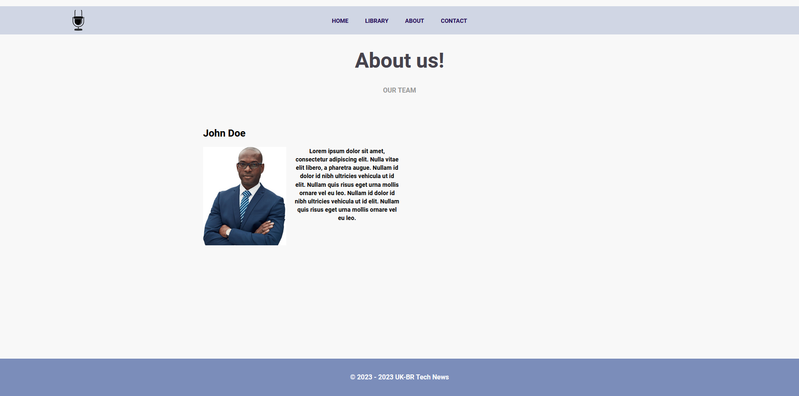
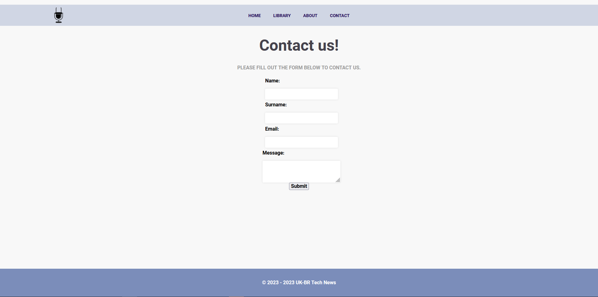

# Simple Blog

This is a simple blog application built with PHP vanilla.  

## Installation
To install the application, run the following command:  

run `npm install`

## Database
The application includes a hard-coded database stored in the data folder. The database is represented as an array, and you can add more data by adding more elements to the array. This allows you to test the application's responsiveness.

## Target
The goal of this project is to build a simple blog application using vanilla PHP and demonstrate the ability to write clean, responsive, and maintainable code. The application generates news pages automatically based on the data from the database and provides a library of blog posts.

## Features to add
Here are some features I plan to add in the future:
- [ ] Search bar
- [ ] Login page
- [ ] Integration with a database

## Additional Information
I built this application using only vanilla PHP and some CSS, without any framework. I did not use Javascript for this project, but if you want to see my Javascript skills, API manipulation, React or other feel free to check out my other projects.
I also have a Laravel project that I didn't finish yet, but I plan to finish it soon, but even unfinished it's a good example of my Laravel skills.

## APP screenshots
_**Index.php**_

_**Post.php**_

_**library.php**_

_**about.php**_

_**contact.php**_

